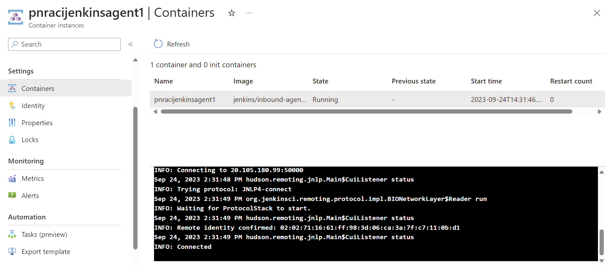
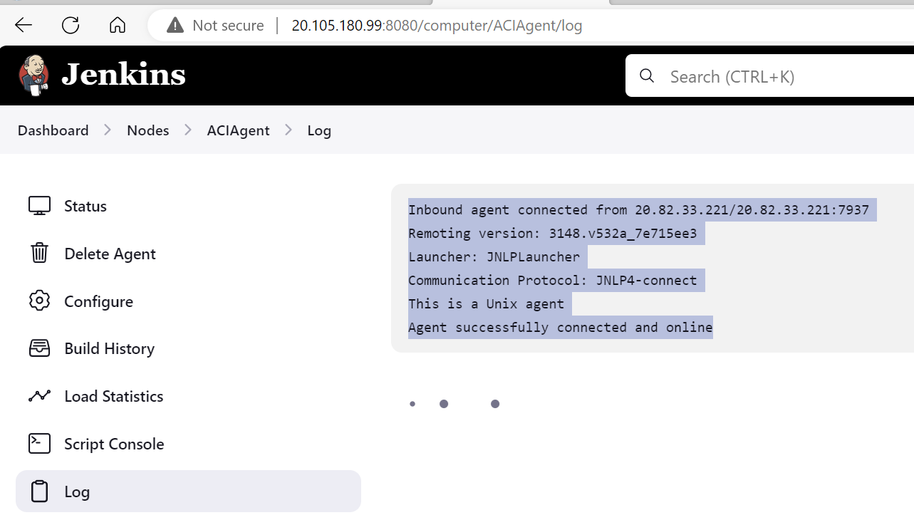

# DATE: 24-09-2023, 19-09-2023
# MY IDEA: Create Ubuntu VM in Azure, then install Docker

# Create a virtual machine
## Create a test directory called jenkins-get-started.
    cd jenkins-docker

# CLI - Create VM
## Login
    az login --tenant pietronromanolive.onmicrosoft.com
    az account set --subscription "26b58bc5-ccfe-48a9-b00e-51d89e19a4db"

## Variables
    rg=jenkins-docker-rg
    vm=jenkins-docker-vm
    loc=westeurope
    user=azureuser

## Run az group create to create a resource group.
  az group create --name $rg --location westeurope

## List VM images with Ubuntu
  az vm image list --query \
  "[].{Alias:urnAlias, SKU: sku, Version: version} | [? contains(Alias,'Ubuntu')]" \
  -o table

## Run az vm create to create a virtual machine. 
  az vm create \
  --resource-group $rg \
  --name $vm \
  --image Ubuntu2204 \
  --admin-username $user \
  --generate-ssh-keys \
  --public-ip-sku Standard \
  --custom-data cloud-init-docker.txt

## Enable auto-shutdown
  az vm auto-shutdown -g $rg -n $vm --time 1900 --email "pietronromano@live.com" 

### Run az vm list to verify the creation (and state) of the new virtual machine.
    az vm list -d -o table --query "[?name=='${vm}']"

### As Jenkins runs on port 8080, run az vm open to open port 8080 on the new virtual machine.
    az vm open-port \
    --resource-group $rg \
    --name $vm  \
    --port 8080 --priority 1010

# Jenkins agents connect to the controller via port 50000, ensure that port is allowed inbound to the Jenkins Controller.
## NOTE: MS article says 5000!, but Jenkins is 50000 by default
## THIS ALSO NEEDS TO BE EXPOSED BY THE Docker CONTAINER ALSO (SEE docker-compose.yml ): 
    az vm open-port \
    --resource-group $rg \
    --name $vm  \
    --port 50000 --priority 1050

# Configure Jenkins
## Run az vm show to get the public IP address for the sample virtual machine.
### MINE: Save the ip to a variable, tsv removes the quotes
  ip="$(az vm show \
    --resource-group $rg \
    --name $vm -d \
    --query [publicIps] \
    --output tsv)"
  echo $ip

### Copy File: Use Docker Compose to Create Jenkins and SSH Agent Image
    scp docker-compose.yml $user@$ip:/home/azureuser 

### SEE 
  https://github.com/jenkinsci/docker/tree/master#docker-compose-with-jenkins
  https://github.com/jenkinsci/ssh-slaves-plugin/blob/main/doc/CONFIGURE.md

## Login to the VM with SSH
    ssh $user@$ip

### Check Docker is installed
    docker info

### Use Docker Compose to Create Jenkins and SSH Agent Image
#### NOTE: couldn't use any "-f" flag for file, had to be docker-compose.yml
    sudo apt install docker-compose
    docker-compose up -d 
    docker container list

## Get the admin pwd
    docker exec -it 6ddd98d6edc0 bash
    cat /var/jenkins_home/secrets/initialAdminPassword
 
### My User: pietronromano, Travies1
    http://20.105.180.99:8080/

# Agent with ACI: Take note of Name and Secret on Status Page
  curl -sO http://20.105.180.99:8080/jnlpJars/agent.jar
  java -jar agent.jar -jnlpUrl http://20.105.180.99:8080/computer/ACIAgent/jenkins-agent.jnlp -secret 1fcc222e3d414745d0a76b86db9f2526d5ec4e233854ff8aaa78f4da6af45c44 -workDir "/home/jenkins/work"

## Create ACI
# SOURCE: https://learn.microsoft.com/en-us/azure/developer/jenkins/azure-container-instances-as-jenkins-build-agent

  aci_image_mvn="jenkins/jnlp-agent-maven"
  SEVERE: Agent version 4.7 or newer is required.
 
 ## Variables
    aci=pnracijenkinsagent1
    aci_image="jenkins/inbound-agent:latest"
    AGENT_NAME="ACIAgent"
    JENKINS_SERVER_PORT="http://"$ip":8080"
    JENKINS_SECRET="1fcc222e3d414745d0a76b86db9f2526d5ec4e233854ff8aaa78f4da6af45c44"
    aci_command="\"jenkins-agent -url ${JENKINS_SERVER_PORT} ${JENKINS_SECRET} ${AGENT_NAME}\""
    echo $aci_command

## NOTE: couldn't get the $aci_command to be recognized, had to write literal
az container create \
  --name $aci \
  --resource-group $rg \
  --ip-address Public \
  --image $aci_image \
  --os-type linux \
  --ports 80 \
  --command-line "jenkins-agent -url http://20.105.180.99:8080 1fcc222e3d414745d0a76b86db9f2526d5ec4e233854ff8aaa78f4da6af45c44 ACIAgent"

# SUCCESS: SEE CHECK AGENT STATUS!
-
-

## NOTE: Creates File in Build Name Directory, appends current time on every build
    #!/bin/sh
    file_name=time_log.txt
    current_time=$(date "+%Y.%m.%d-%H.%M.%S")
    echo "Writing to $current_time to $file_name"
    echo "Current Time : $current_time" >> $file_name

    jenkins@SandboxHost-638311626773842735:/home/jenkins/work/workspace/MyTime$ ls
    time_log.txt

# Local Docker Desktop
  hostWorkDir="/C/dev/jenkins/workDir"  
  containerWorkDir="/home/jenkins/agent"
  docker container rm -f inbound-agent
  docker container run \
    --name inbound-agent \
    --volume $hostWorkDir:$containerWorkDir \
    --detach \
    --init jenkins/inbound-agent -url http://20.105.180.99:8080 \
    d55ce5f1a058cb27163e9cf17e76152c12cbf878d92ffd3825df36392065c64e DockerAgent

# Docker Build: Maven
## Docker.jenkins-agent-mvn downloads, installs maven and adds it to the path
    mvn_img="pietronromano/jenkins-agent-mvn"
    docker image rm -f $mvn_img
    docker image build -f Docker.jenkins-agent-mvn -t $mvn_img .
    
    mvn_con="inbound-agent-mvn"
    docker container rm -f $mvn_con
    docker run \
    --name $mvn_con \
    --volume $hostWorkDir:$containerWorkDir \
    --detach \
    --init $mvn_img -url http://20.105.180.99:8080 \
    d55ce5f1a058cb27163e9cf17e76152c12cbf878d92ffd3825df36392065c64e DockerAgent
## SSH into the container
    docker exec -it $mvn_con bash
## Maven is in the path, works with a logon, but not from the Job shell
    mvn --version

# Pipeline Script pasted directly in Jenkins Pipeline UI
## SEE jenkins-pipelines/Pipeline-HelloWorkd {
## Target to the DockerAgent
    agent {label 'DockerAgent'}

### See Results in Docker container
    docker exec -it inboud-agent sh
    cd /var/jenkins_home/workspace/Pipeline-HelloWorld
    cat time_log.txt

# TODO Java App with Maven
## SOURCE: https://www.jenkins.io/doc/tutorials/build-a-java-app-with-maven/
## MY FORK: https://github.com/pietronromano/simple-java-maven-app

## Once inside the VM, clone locally
  git clone https://github.com/pietronromano/simple-java-maven-app
  cd simple-java-maven-app

  vi Jenksinfile
  (can CTRL+V to paste clipboard content)

# Add to repo
  git add .
  git commit -m "Add initial Jenkinsfile"

# PIPELINE FAILURE
lookup docker on 127.0.0.11:53: server misbehaving

# Stop Container
    az container stop -n $aci -g $rg
## Start
    az container start -n $aci -g $rg

# Deallocate (Stop is still billed) / Delete the VM / RG
    az vm deallocate --resource-group $rg  --name $vm 
## Start
    az vm start --resource-group $rg  --name $vm 
    
    az vm delete --resource-group $rg  --name $vm 
    az group delete -g $rg
