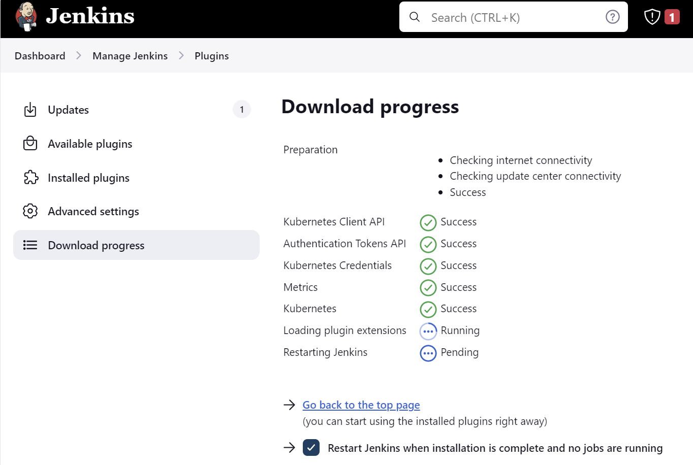

# DATE: 21-09-2023
# SOURCE: https://www.jenkins.io/doc/book/installing/kubernetes
# RESULTS: 
- SUCCESS! Managed to setup cluster, with pv/pvc disks
- AGENTS:

# Dir
    cd jenkins-kubernetes

# Login
    az login --tenant pietronromanolive.onmicrosoft.com
    az account set --subscription "26b58bc5-ccfe-48a9-b00e-51d89e19a4db"

# Main Variables
    rg="jenkins-aks-rg"
    clu="pnrjenaks1"
    loc="westeurope"
    ns="jenkins-ns"

# Create RG and Cluster
    az group create -n $rg --location $loc
    az aks create -g $rg -n $clu --enable-managed-identity --node-count 1 --generate-ssh-keys

# Start/Stop the cluster
    az aks start -g $rg  -n $clu
    az aks stop -g $rg  -n $clu

# Get context
    az aks get-credentials --resource-group $rg --name $clu

# Step 1: Create a Namespace for Jenkins. 
    kubectl create namespace $ns
    kubectl delete namespace $ns

## create the service account using kubectl.
    kubectl apply -f serviceAccount.yaml

# https://learn.microsoft.com/en-us/azure/aks/azure-csi-disk-storage-provision
## Identify the node resource group name 
    disk_rg=$(az aks show --resource-group $rg --name $clu --query nodeResourceGroup -o tsv)
    echo $disk_rg

## Get the disk resource
    disk=jenkinsDisk
    az disk create \
      --resource-group $disk_rg \
      --name $disk \
      --size-gb 20 \
      --query id --output tsv

## Create a pv-azuredisk.yaml file with a PersistentVolume. Update volumeHandle with disk resource ID from the previous step.
    /subscriptions/26b58bc5-ccfe-48a9-b00e-51d89e19a4db/resourceGroups/MC_jenkins-aks-rg_pnrjenaks1_westeurope/providers/Microsoft.Compute/disks/jenkinsDisk

## Create the PersistentVolume and PersistentVolumeClaim using the kubectl apply command and reference the two YAML files you created.
    kubectl apply -f pv-azuredisk.yaml
    kubectl apply -f pvc-azuredisk.yaml

## Verify your PersistentVolumeClaim is created and bound to the PersistentVolume using the kubectl get pvc command.
    kubectl get pvc pvc-azuredisk -n $ns

## Update deployment.yaml to reference the claim
      volumes:
        - name: jenkins-data
          persistentVolumeClaim:
              claimName: pvc-azuredisk # jenkins-pv-claim

# Create the deployment using kubectl.

    kubectl apply -f deployment.yaml
    kubectl delete -f deployment.yaml

## Check the deployment status.
### NOTE: Takes a few minutes for all this to come online
    kubectl get deployments -n $ns -w
    kubectl describe deployment jenkins -n $ns

    kubectl get pods -o wide -n $ns
  ### Search for a specific pod, save name in the variable
    jenkins_pod=$(kubectl get pods -n $ns -l app=jenkins-server -o=jsonpath='{.items[].metadata.name}')
    echo $jenkins_pod

    kubectl describe pod $jenkins_pod -n $ns

# Create the Jenkins service using kubectl.
    kubectl apply -f service.yaml
## Check the external ip
    kubectl get svc -n $ns -w

## IP
    http://51.105.128.37:8080

# Jenkins will ask for the initial Admin password when you access the dashboard for the first time.
## You can get that from the pod logs either from the Kubernetes dashboard or CLI. 
# With the pod name, you can get the logs as shown below. Replace the pod name with your pod name.
    kubectl logs $jenkins_pod -n $ns

## The password can be found at the end of the log.
    c53813e57e594eb0a3588b7cbb27bcf7

## my user
    pietronromano Travies1

# Alternatively, you can run the exec command to get the password directly from the location as shown below.
  kubectl exec -it $jenkins_pod -n $ns -- bash
  cat /var/jenkins_home/secrets/initialAdminPassword

# Stop the cluster
    az aks stop -g $rg  -n $clu
# Delete the cluster
    az aks delete -g $rg  -n $clu

# Kubernetes
## SOURCE: https://www.jenkins.io/doc/book/scaling/scaling-jenkins-on-kubernetes/
## Installed Kubernetes plugin from UI

# Get Cluster IP
    kubectl cluster-info

    Kubernetes control plane is running at https://pnrjenaks1-jenkins-aks-rg-26b58b-p52h6eaf.hcp.westeurope.azmk8s.io:443
    CoreDNS is running at https://pnrjenaks1-jenkins-aks-rg-26b58b-p52h6eaf.hcp.westeurope.azmk8s.io:443/api/v1/namespaces/kube-system/services/kube-dns:dns/proxy
    Metrics-server is running at https://pnrjenaks1-jenkins-aks-rg-26b58b-p52h6eaf.hcp.westeurope.azmk8s.io:443/api/v1/namespaces/kube-system/services/https:metrics-server:/proxy

## UI -> Install Kubernetes AND Docker plugins
- Fill in the Kubernetes plugin configuration. 
- In order to do that, open the Jenkins UI and navigate to “Manage Jenkins → Nodes and Clouds → Clouds → Add a new cloud → Kubernetes and fill in the Kubernetes URL and Jenkins URL appropriately, by using the values which we have just collected in the previous step.

## API Server
    https://pnrjenaks1-jenkins-aks-rg-26b58b-p52h6eaf.hcp.westeurope.azmk8s.io:443

## Kubernetes POD -> IP
    kubectl describe pod $jenkins_pod -n $ns
    IP: 10.244.0.12

# Pipelines with Kubernetes
## REFERENCES
- https://www.hatica.io/blog/ci-cd-pipeline-with-jenkins-and-kubernetes/
- https://plugins.jenkins.io/kubernetes/
- https://www.youtube.com/watch?v=q4g7KJdFSn0&t=2726s
    - https://github.com/dmancloud/complete-prodcution-e2e-pipeline
    - https://github.com/dmancloud/gitops-complete-prodcution-e2e-pipeline